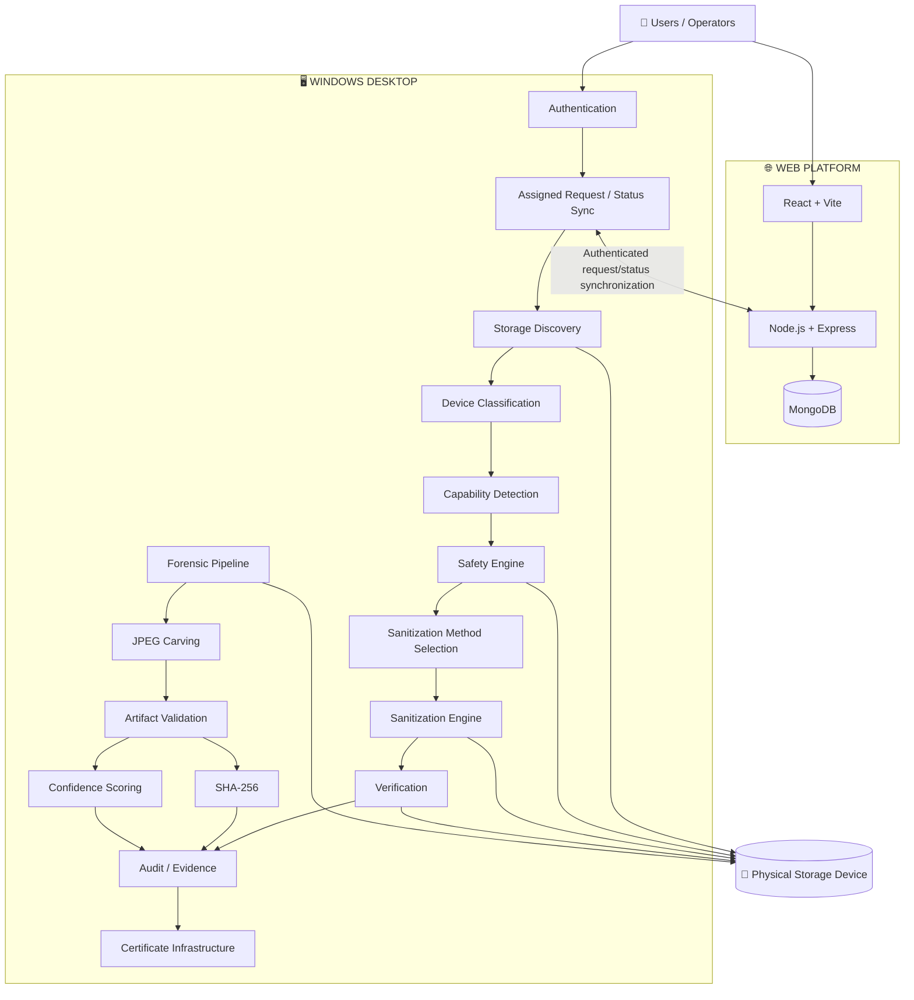
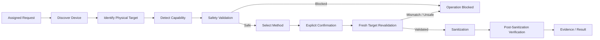
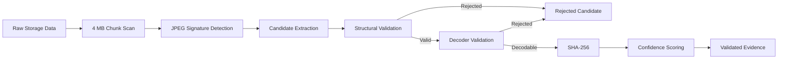

<div align="center">

# 🛡️ SecureWipe

### Integrated Secure Data Erasure & Advanced File Recovery Platform

**Smart India Hackathon 2026 · SIH26149**

**Team FOREIGN WIPE**

[](https://www.sih.gov.in/)


[](https://react.dev/)
[](https://vite.dev/)
[](https://isocpp.org/)
[](https://www.qt.io/)
[](https://nodejs.org/)
[](https://expressjs.com/)
[](https://www.mongodb.com/)
[](https://cmake.org/)
[](https://jestjs.io/)

</div>

---

## 🏆 SIH Problem Statement

**Problem Statement ID:** `SIH26149`

**Title:** *Design and Development of an Integrated Secure Data Erasure and Advanced File Recovery Tool for Digital Forensics and Data Sanitization*

**Category:** Software

**Theme:** Blockchain & Cybersecurity

**Team:** **FOREIGN WIPE**

---

## ⚠️ Current Validation Status

> **SecureWipe does not currently claim a successfully demonstrated destructive secure wipe on real hardware.**

The project has exercised its storage discovery, safety and sanitization-decision workflow on real Windows storage hardware. During the recorded real-hardware E2E test, the workflow reached the physical write stage, where Windows returned:

```text
ERROR_ACCESS_DENIED
Windows Error 5
0 bytes written
```

Accordingly, this README does **not** present that test as a successful wipe.

### Current state

| Area | Status |
|---|---|
| Windows storage discovery | 🟢 Implemented / tested |
| Physical-device identification | 🟢 Implemented / exercised |
| Storage-property detection | 🟢 Implemented / tested |
| Device classification | 🟡 Foundation implemented |
| Capability detection | 🟢 Tested on real devices |
| Safety Engine | 🟡 Implemented; some safety coverage remains in development |
| Sanitization method selection | 🟢 Implemented |
| Final target revalidation | 🟢 Implemented |
| Physical destructive write | 🔴 Successful E2E execution not demonstrated |
| Post-sanitization verification | ⏳ Pending successful destructive execution |
| Certificate workflow | 🟡 Infrastructure exists; complete workflow remains |
| JPEG carving | 🟢 Implemented / tested |
| JPEG decoder validation | 🟢 Implemented / tested |
| SHA-256 hashing | 🟢 Implemented / tested |
| Confidence scoring | 🟢 Implemented / tested |
| Broader forensic recovery | ⏳ Future scope |

---

# What SecureWipe Is

SecureWipe combines two related capabilities within one project:

### 🛡️ Secure Data Sanitization

- Physical storage-device discovery
- Storage-property inspection
- Device classification
- Sanitization capability detection
- Safety validation before destructive execution
- Target identity validation
- Device-aware sanitization method selection
- Explicit operator confirmation
- Final target revalidation
- Sanitization execution
- Post-sanitization verification path
- Audit and evidence infrastructure
- Certificate-generation infrastructure

### 🔎 Digital Forensics & File Recovery

- Read-oriented raw storage scanning
- Signature-based artifact detection
- JPEG carving
- Chunk-boundary handling
- Candidate extraction
- Structural validation
- Decoder-based JPEG validation
- SHA-256 hashing
- Explainable confidence scoring
- Separation of rejected candidates from validated evidence

The forensic workflow is kept separate from destructive sanitization.

---

# Why the Project Exists

The SIH problem statement combines secure data erasure with advanced file recovery for digital forensics and data sanitization.

SecureWipe therefore works around two questions:

> **Can the intended physical storage device be identified, validated and sanitized through a controlled workflow?**

and

> **Can deleted information be recovered and processed as forensic evidence when required?**

The project is designed around the combination of storage-device sanitization, safety controls, verification/evidence handling and forensic recovery.

---

# 🏗️ System Architecture

SecureWipe contains two application layers:

1. **Web platform** — organizational workflows, authentication, users, workstations and sanitization requests.
2. **Windows desktop application** — storage-device discovery, safety validation, sanitization and forensic operations that require local Windows storage access.

The desktop application communicates with the backend for authentication and assigned request/status synchronization. The physical storage operations are performed by the Windows desktop side.



## Architectural Boundary

```text
┌────────────────────────────────────────────────────────────┐
│                     WEB PLATFORM                           │
│                                                            │
│  React + Vite → Node.js + Express → MongoDB               │
│                                                            │
│  Authentication · Users · Roles · Workstations             │
│  Sanitization Requests · Request Lifecycle                 │
└──────────────────────────────┬─────────────────────────────┘
                               │
                     Authenticated REST
                  Request / Status Synchronization
                               │
                               ▼
┌────────────────────────────────────────────────────────────┐
│                  WINDOWS DESKTOP                           │
│                                                            │
│  Qt / C++                                                   │
│                                                            │
│  Discovery · Classification · Capability · Safety          │
│  Sanitization · Verification · Evidence · Forensics        │
└──────────────────────────────┬─────────────────────────────┘
                               │
                    Windows Storage APIs
                               │
                               ▼
                     Physical Storage Device
```

---

# 🔐 Controlled Sanitization Workflow

The destructive path is designed to pass through safety and target checks before execution.



### Important distinction

Reaching the sanitization stage is **not** treated as proof that sanitization succeeded.

The current real-hardware E2E result demonstrates that the workflow reached the physical write boundary, but the write was blocked by Windows with `ERROR_ACCESS_DENIED`.

---

# 🧩 Sanitization Method Selection

SecureWipe uses device-aware method selection.

The current implementation contains the following selection logic:

| Storage type | Current selection logic |
|---|---|
| **NVMe** | Use native NVMe Sanitize when the required NVMe sanitize capability is reported as supported; otherwise the current path is unsupported |
| **SATA** | Use ATA Sanitize when supported; otherwise use Host Overwrite |
| **USB** | Current implementation selects Host Overwrite |
| **Other / unsupported** | Unsupported |

Capability detection is used to inform the sanitization decision. For the tested real devices, native sanitize support was recorded as unknown where the hardware did not report a confirmed supported state.

---

# 🛡️ Safety Engine

The Safety Engine is positioned between target selection and destructive execution.

Current safety-related checks include:

- System-disk protection
- Mounted-volume relationship checks
- Physical-device identity checks
- Target identity comparison
- Device/request consistency checks
- Required safety conditions
- Final target revalidation before execution

The intended safety behavior is **fail closed**: when required safety conditions are not satisfied, destructive execution is blocked.

### Target identity

The target identity logic compares device information such as:

- Device ID
- Model
- Serial
- Capacity

This is used to reduce the risk of executing a request against a different physical device.

### Boot dependency status

Windows boot/BCD detection infrastructure exists in the project, but the complete BCD-to-physical-disk mapping and enforcement path is **not yet complete**.

Therefore SecureWipe does **not** claim fully implemented boot-dependency protection.

---

# 🔎 Digital Forensics Pipeline

The current forensic implementation focuses on JPEG artifacts and uses a read-oriented raw-storage workflow.



### Current forensic capabilities

| Capability | Status |
|---|---|
| Raw/read-oriented scanning | 🟢 Implemented |
| 4 MB chunk-based scanning | 🟢 Implemented |
| JPEG signature detection | 🟢 Implemented |
| Cross-chunk / boundary handling | 🟢 Implemented and tested |
| Candidate extraction | 🟢 Implemented |
| Structural validation | 🟢 Implemented |
| JPEG decoder validation | 🟢 Implemented and tested |
| SHA-256 integrity hashing | 🟢 Implemented and tested |
| Explainable confidence scoring | 🟢 Implemented and tested |
| Validated evidence separation | 🟢 Implemented |
| Multiple advanced carving strategies | ⏳ Future scope |
| Broad multi-format recovery | ⏳ Future scope |
| Complete forensic report package | 🟡 In development |

## Evidence confidence scoring

The current confidence scoring uses the following components:

| Validation signal | Score |
|---|---:|
| JPEG header | +20 |
| JPEG footer | +20 |
| Size | +15 |
| Structure | +20 |
| Decodable | +25 |

The resulting score is classified as:

| Score | Classification |
|---:|---|
| 80–100 | HIGH |
| 50–79 | MEDIUM |
| 1–49 | LOW |
| 0 | UNKNOWN |

This makes the forensic result explainable rather than treating every signature hit as a recovered file.

---

# 📜 Evidence, Audit & Certificate Infrastructure

SecureWipe contains infrastructure for connecting sanitization and forensic processing with evidence information.

### Audit logging

The desktop audit logger records JSONL audit events and uses a previous-event hash plus an event hash to form a chained audit structure.

An audit-chain verifier is also present in the project.

### Certificate infrastructure

The desktop project contains certificate-generation and certificate-validation components.

A sanitization certificate is intended to represent a successfully completed and verified sanitization operation. The current project does **not** claim a completed end-to-end certificate workflow following a successful destructive hardware wipe because the required successful destructive E2E validation has not yet been demonstrated.

### Evidence principle

```text
Attempted Operation
        ↓
Execution Result
        ↓
Verification Result
        ↓
Evidence
        ↓
Certificate, when the required conditions are satisfied
```

An attempted wipe is not represented as a successful wipe.

---

# 🌐 Web Platform

The web layer provides the management and request side of SecureWipe.

Current project functionality includes:

- User registration and login
- Authentication
- Role-based access control
- Role-based dashboards
- User management
- Workstation management
- Sanitization request creation
- Employee assignment workflow
- Request lifecycle handling
- MongoDB persistence

### Authentication and security technologies

- JWT authentication
- RS256 signing
- JWT expiry validation
- JWT issuer and audience validation
- Argon2 password hashing
- Backend-enforced RBAC

---

# 🖥️ Windows Desktop Application

The desktop application is the hardware-facing part of SecureWipe.

It contains:

- Qt-based user interface
- Employee workflow
- Storage-device discovery
- Device classification
- Storage-property inspection
- Capability detection
- Safety validation
- Sanitization method selection
- Physical-device integration
- Forensic scanning and recovery workflows

The desktop application also synchronizes assigned sanitization requests and employee status information with the backend.

---

# 🧪 Testing & Validation

Testing is performed across the web and desktop portions of the project.

### Desktop / C++ side

The CMake configuration includes dedicated test executables covering areas such as:

- Storage capability detection
- Host overwrite E2E testing
- Safety Engine behavior
- Sanitization pipeline and audit behavior
- Audit-chain verification
- Certificate verification
- Forensic evidence collection
- JPEG carving
- Evidence validation
- Hashing
- Confidence scoring

The desktop tests use executable return codes and manual output rather than a GoogleTest/Catch2-style assertion framework.

### Web backend

The backend uses:

- Jest
- Supertest

### Real hardware validation

Real Windows storage devices have been used for storage discovery, capability-related testing and forensic JPEG carving validation.

The recorded destructive E2E test reached the physical write stage but failed with:

```text
ERROR_ACCESS_DENIED
Windows Error 5
0 bytes written
```

This result remains documented as a failed destructive validation rather than being represented as a successful wipe.

---

# 📊 Implementation Status

## Implemented / exercised

- React/Vite web frontend
- Node.js/Express backend
- MongoDB persistence
- User authentication
- JWT/RS256 authentication
- Argon2 password hashing
- Backend RBAC
- User and workstation management
- Sanitization request foundations
- Qt/C++ desktop application
- Windows storage discovery
- Storage-property detection
- Device classification foundation
- Capability detection
- Safety Engine foundation
- Request → device → safety integration
- Sanitization method-selection infrastructure
- Host Overwrite path
- NVMe sanitization method-selection infrastructure
- Forensic JPEG carving
- JPEG cross-chunk handling
- JPEG structural validation
- JPEG decoder validation
- SHA-256 hashing
- Confidence scoring
- Audit-chain infrastructure
- Certificate infrastructure

## Validation / integration still in progress

- Successful destructive sanitization on controlled real hardware
- Independent post-sanitization verification after a successful destructive run
- Complete certificate workflow
- Complete evidence serialization/reporting workflow
- Complete boot-dependency enforcement
- Broader storage-device validation
- Broader forensic artifact support
- Advanced fragmented-file reconstruction
- Expanded forensic reporting
- Additional security hardening

---

# 🧱 Technology Stack

| Layer | Technology |
|---|---|
| Web frontend | React |
| Frontend tooling | Vite |
| Desktop application | C++ / Qt |
| Backend | Node.js / Express |
| Database | MongoDB / Mongoose |
| Authentication | JWT / RS256 |
| Password hashing | Argon2 |
| Windows storage access | Windows storage and device APIs |
| Cryptographic hashing | Windows CNG / BCrypt |
| JPEG validation | libjpeg-turbo |
| Build system | CMake |
| Windows deployment | windeployqt |
| API testing | Jest / Supertest |

---

# 📁 Repository Structure

The current project is organized into separate desktop, web and documentation areas.

```text
SecureWipe/
│
├── desktop/
│   ├── backend/
│   │   ├── classification/
│   │   ├── discovery/
│   │   ├── forensic/
│   │   ├── safety/
│   │   ├── sanitization/
│   │   ├── storage/
│   │   ├── verification/
│   │   └── tests/
│   │
│   └── frontend/
│
├── web/
│   ├── backend/
│   └── frontend/
│
└── SecureWipedocs/
    ├── docs/
    ├── decisions/
    ├── daily-reports/
    ├── screenshots/
    ├── test-results/
    └── presentation/
```

> The documentation directory is currently maintained under `SecureWipedocs/`. Documentation links can be added or refined as the documentation set is finalized.

---

# 🔗 SIH Requirement Alignment

| SIH functional area | Current SecureWipe coverage |
|---|---|
| Secure Drive Eraser | Device-aware sanitization architecture and hardware integration |
| Verification | Verification architecture; successful destructive E2E verification pending |
| Audit logging / evidence | Audit and evidence infrastructure |
| Secure File & Folder Eraser | Current implementation scope is documented; do not interpret this README as claiming a completed file/folder eraser |
| Advanced File Carving & Recovery | JPEG carving and validation pipeline |
| Signature-based carving | JPEG signature detection |
| Filesystem-independent recovery | Raw storage scanning within the current forensic scope |
| Fragmented / cross-boundary handling | Chunk-boundary handling for supported JPEG recovery |
| Automatic classification | Device classification foundation and forensic/device classification scope |
| Confidence scoring | Explainable confidence scoring |
| Forensic reporting | Evidence-oriented workflow; complete report package remains in development |
| Evidential integrity | SHA-256 hashing and evidence handling |
| Multiple storage technologies | Windows storage discovery and capability architecture |
| GUI | React web application and Qt desktop application |
| Testing documentation | Structured test results and hardware validation evidence |

---

# 🚧 Limitations

SecureWipe is an active engineering and validation project. The following limitations are important:

1. **Successful destructive sanitization has not yet been demonstrated on controlled real hardware.**
2. The recorded physical write test failed with Windows `ERROR_ACCESS_DENIED` and wrote zero bytes.
3. Post-sanitization verification therefore remains pending after a successful destructive execution.
4. Boot dependency enforcement is not yet complete.
5. Native NVMe sanitize support has not been fully demonstrated on real hardware.
6. USB currently uses the Host Overwrite selection path.
7. Forensic recovery is currently focused on JPEG artifacts.
8. Broader multi-format carving is future scope.
9. Complete forensic reporting remains in development.
10. The project should not be represented as a production-certified storage sanitization product.

---

# 🗺️ Roadmap

### Sanitization

- Resolve Windows raw-device write access
- Complete controlled destructive hardware testing
- Implement and validate post-sanitization verification
- Expand storage-device validation
- Complete certificate workflow
- Strengthen evidence serialization

### Forensics

- Add additional file signatures
- Add additional artifact validators
- Expand fragmented-file reconstruction
- Broaden automated classification
- Expand forensic reporting
- Expand recovery coverage beyond JPEG

### Platform hardening

- Expand authorization testing
- Add rate limiting and abuse controls
- Strengthen secure session/token handling
- Add additional audit controls
- Perform performance benchmarking

---

# ⚠️ Safety Notice

**SecureWipe performs or is designed to perform destructive storage operations.**

Never test destructive sanitization against:

- The operating-system disk
- A production workstation
- A drive containing irreplaceable data
- Any device that has not been explicitly designated for destructive testing

Use dedicated sacrificial hardware and a controlled test environment.

The forensic scanning workflow is read-oriented and must not be interpreted as proof that destructive sanitization has occurred.

---

# 📌 Documentation Principle

> **The source code and reproducible test evidence determine what is implemented.**

Historical development notes, screenshots, prototypes and planned architecture provide context, but they are not treated as proof of completed functionality.

Failed validation remains documented as failed until the test is successfully repeated.

---

## Smart India Hackathon 2026

**Problem Statement:** `SIH26149`

**Title:** *Design and Development of an Integrated Secure Data Erasure and Advanced File Recovery Tool for Digital Forensics and Data Sanitization*

**Team:** **FOREIGN WIPE**

---

<div align="center">

### 🛡️ SecureWipe

**Secure Data Sanitization · Digital Forensics · Evidence · Verification**

**FOREIGN WIPE · Smart India Hackathon 2026**

</div>
